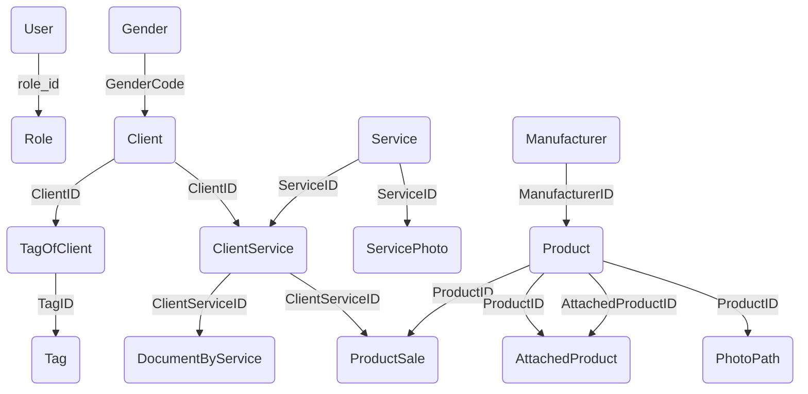

# ListServicesApp
Данное приложение предназначено для того, чтобы работать с базой данных lang2, в которой люди хотят заказывать услуги у компании "Школа learn". 

## Страницы
В данном приложении имеется:

 1.Основное окно (Старт). В нем имеются:
 
 
    1.1 Страница авторизации. LoginPage
    
    
    1.2 Страница регистрации. RegistationPage
    
    
    1.3 Страница "Забыли пароль", IDKPasswordPage
    
 2.Основное окно для пользователя.
 
 
    2.1 Страница услуг. ServicesPage
    
    
    2.2 Страница профиля, ProfilePage
    
    
    2.3 Страница уведомлений, NotificationsPage
    
    
    2.4 Страница покупок, ShoppingCardPage
    
 3. Основная страница для администратора
 
 
 
    3.1 Страница вкладок(вспомогательная). AdminPanel
    
    
    
    3.2 страница таблиц, TablesPage
    
    
    
    3.3 Страница клиентов, которые будут сегодня и завтра, ClientNowPage
    
    
    
    3.4 Страница адаптированная под любую таблицу, AdaptiveTablePage
    
    
    
    3.5 Страница полностью адаптированная под [dbo].[Service], choiseService
    
    
    
    3.6 Страница полностью адаптированная под добавление любой записи для любой таблицы, addDataPage
    
    
    
    3.7 Страница адаптированная под редактирование любой записи для любой таблицы, EditPage

## Диаграмма базы данных

## Как запустить на вашем PC?
Для того чтобы запустить программу на вашем ПК необходимо
1. Установить программы Microsoft SQL management studio и Visual Studio 2022
2. Интегрировать БД.
3. Запустить sln файл и по пути ApplicationForBD-ApplicationDataBases-AppConnect.cs изменить в строчке sqlConnection поля Data Source='имя вашего подключения к бд' и Initial Catalog='имя БД'
