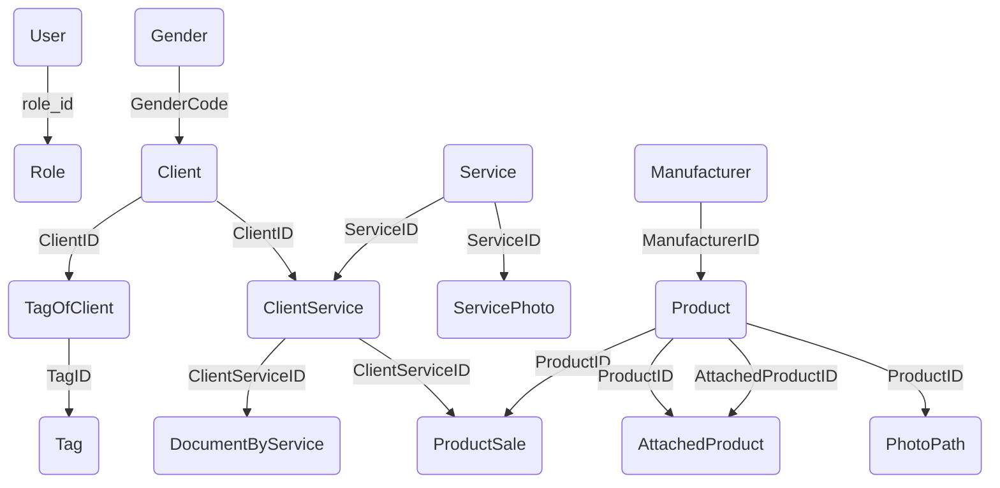

# ListServicesApp
Данное приложение предназначено для того, чтобы работать с базой данных lang2, в которой люди хотят заказывать услуги у компании "Школа learn". 

## Страницы
В данном приложении имеется:
1. Основное окно (Старт). В нем имеются:
    * Страница авторизации. LoginPage
    * Страница регистрации. RegistationPage
    * Страница "Забыли пароль", IDKPasswordPage
2. Основное окно для пользователя.
    * Страница услуг. ServicesPage
    * Страница профиля, ProfilePage
    * Страница уведомлений, NotificationsPage
    * Страница покупок, ShoppingCardPage
3. Основная страница для администратора
    * Страница вкладок(вспомогательная). AdminPanel
    * страница таблиц, TablesPage
    * Страница клиентов, которые будут сегодня и завтра, ClientNowPage
    * Страница адаптированная под любую таблицу, AdaptiveTablePage
    * Страница полностью адаптированная под [dbo].[Service], choiseService
    * Страница полностью адаптированная под добавление любой записи для любой таблицы, addDataPage
    * Страница адаптированная под редактирование любой записи для любой таблицы, EditPage

## Диаграмма базы данных

## Как запустить на вашем PC?
Для того чтобы запустить программу на вашем ПК необходимо
1. Установить программы Microsoft SQL management studio и Visual Studio 2022
2. Интегрировать БД.
3. Запустить sln файл и по пути ApplicationForBD-ApplicationDataBases-AppConnect.cs изменить в строчке sqlConnection поля Data Source='имя вашего подключения к бд' и Initial Catalog='имя БД'
## Аккаунты
#### Аккаунты без личных данных
* login: admin, password: admin, email: admin@admin.ru, role: admin
* login: client, password: client, email: client@client.ru, role: default
#### Аккаунты с личными данными
* login: 1, password: 1, email: miturria@verizon.net, role: default
* login: 2, password: 2, email: claesjac@me.com, role: default
* login: 3, password: 3, email: ozawa@verizon.net, role: default
* по порядковому номеру далее
____
* login: 49, password: 49 email: attwood@aol.com, role: default
* login 50, password 50, email: drezet@yahoo.com, role: default

